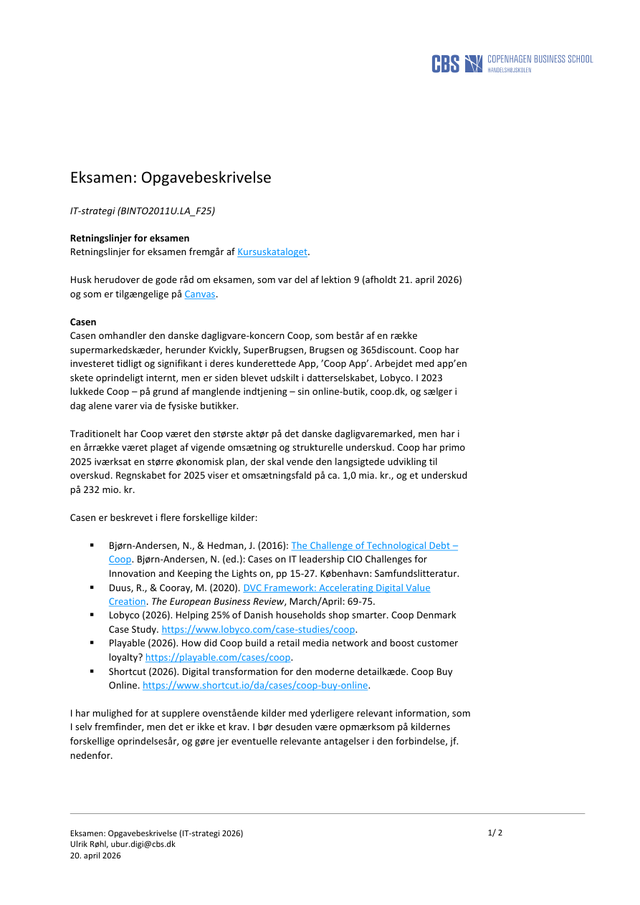
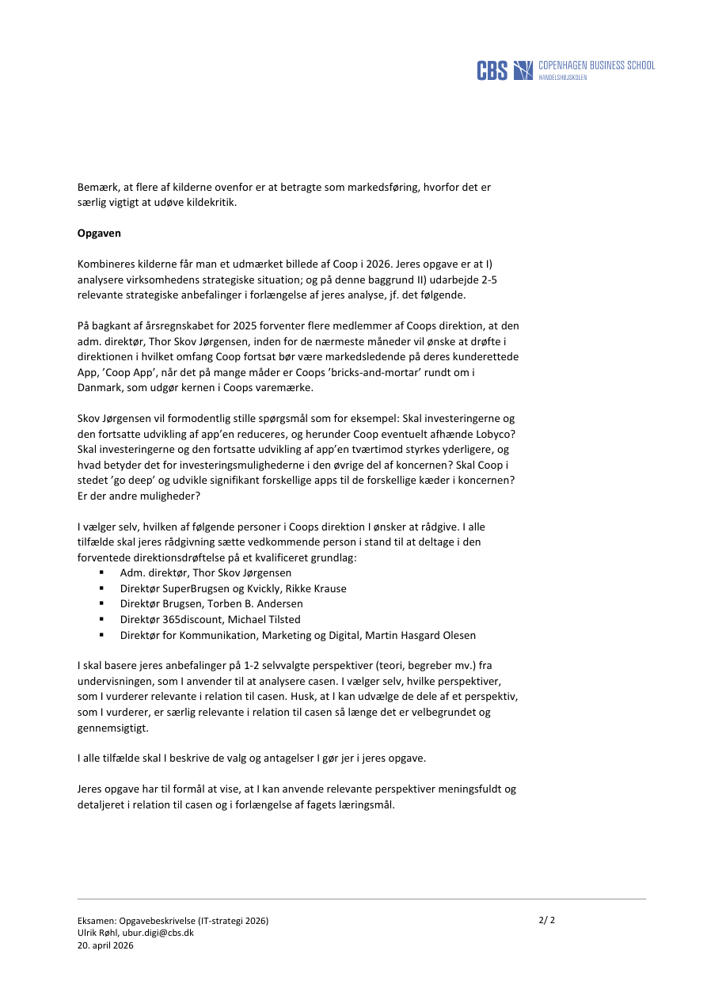

# Eksamen: Opgavebeskrivelse (IT-strategi 2026)

**Source file:** `Opgavebeskrivelse_Eksamen_IT-strategi 2026.pdf`  
**Pages:** 2


> Conversion note: Extracted selectable text and rendered page images are included.


---

## Page 1




### Page text

```text
Eksamen: Opgavebeskrivelse (IT-strategi 2026) 
Ulrik Røhl, ubur.digi@cbs.dk 
20. april 2026 
1/ 2 
Eksamen: Opgavebeskrivelse 
IT-strategi (BINTO2011U.LA_F25) 
Retningslinjer for eksamen 
Retningslinjer for eksamen fremgår af Kursuskataloget. 
 
Husk herudover de gode råd om eksamen, som var del af lektion 9 (afholdt 21. april 2026) 
og som er tilgængelige på Canvas. 
 
Casen 
Casen omhandler den danske dagligvare-koncern Coop, som består af en række 
supermarkedskæder, herunder Kvickly, SuperBrugsen, Brugsen og 365discount. Coop har 
investeret tidligt og signifikant i deres kunderettede App, ’Coop App’. Arbejdet med app’en 
skete oprindeligt internt, men er siden blevet udskilt i datterselskabet, Lobyco. I 2023 
lukkede Coop – på grund af manglende indtjening – sin online-butik, coop.dk, og sælger i 
dag alene varer via de fysiske butikker. 
 
Traditionelt har Coop været den største aktør på det danske dagligvaremarked, men har i 
en årrække været plaget af vigende omsætning og strukturelle underskud. Coop har primo 
2025 iværksat en større økonomisk plan, der skal vende den langsigtede udvikling til 
overskud. Regnskabet for 2025 viser et omsætningsfald på ca. 1,0 mia. kr., og et underskud 
på 232 mio. kr. 
 
Casen er beskrevet i flere forskellige kilder: 
 
▪ 
Bjørn-Andersen, N., & Hedman, J. (2016): The Challenge of Technological Debt – 
Coop. Bjørn-Andersen, N. (ed.): Cases on IT leadership CIO Challenges for 
Innovation and Keeping the Lights on, pp 15-27. København: Samfundslitteratur.  
▪ 
Duus, R., & Cooray, M. (2020). DVC Framework: Accelerating Digital Value 
Creation. The European Business Review, March/April: 69-75. 
▪ 
Lobyco (2026). Helping 25% of Danish households shop smarter. Coop Denmark 
Case Study. https://www.lobyco.com/case-studies/coop. 
▪ 
Playable (2026). How did Coop build a retail media network and boost customer 
loyalty? https://playable.com/cases/coop. 
▪ 
Shortcut (2026). Digital transformation for den moderne detailkæde. Coop Buy 
Online. https://www.shortcut.io/da/cases/coop-buy-online. 
 
I har mulighed for at supplere ovenstående kilder med yderligere relevant information, som 
I selv fremfinder, men det er ikke et krav. I bør desuden være opmærksom på kildernes 
forskellige oprindelsesår, og gøre jer eventuelle relevante antagelser i den forbindelse, jf. 
nedenfor.
```


---

## Page 2




### Page text

```text
Eksamen: Opgavebeskrivelse (IT-strategi 2026) 
Ulrik Røhl, ubur.digi@cbs.dk 
20. april 2026 
2/ 2 
Bemærk, at flere af kilderne ovenfor er at betragte som markedsføring, hvorfor det er 
særlig vigtigt at udøve kildekritik.  
 
Opgaven 
 
Kombineres kilderne får man et udmærket billede af Coop i 2026. Jeres opgave er at I) 
analysere virksomhedens strategiske situation; og på denne baggrund II) udarbejde 2-5 
relevante strategiske anbefalinger i forlængelse af jeres analyse, jf. det følgende. 
 
På bagkant af årsregnskabet for 2025 forventer flere medlemmer af Coops direktion, at den 
adm. direktør, Thor Skov Jørgensen, inden for de nærmeste måneder vil ønske at drøfte i 
direktionen i hvilket omfang Coop fortsat bør være markedsledende på deres kunderettede 
App, ’Coop App’, når det på mange måder er Coops ’bricks-and-mortar’ rundt om i 
Danmark, som udgør kernen i Coops varemærke. 
 
Skov Jørgensen vil formodentlig stille spørgsmål som for eksempel: Skal investeringerne og 
den fortsatte udvikling af app’en reduceres, og herunder Coop eventuelt afhænde Lobyco? 
Skal investeringerne og den fortsatte udvikling af app’en tværtimod styrkes yderligere, og 
hvad betyder det for investeringsmulighederne i den øvrige del af koncernen? Skal Coop i 
stedet ’go deep’ og udvikle signifikant forskellige apps til de forskellige kæder i koncernen? 
Er der andre muligheder? 
 
I vælger selv, hvilken af følgende personer i Coops direktion I ønsker at rådgive. I alle 
tilfælde skal jeres rådgivning sætte vedkommende person i stand til at deltage i den 
forventede direktionsdrøftelse på et kvalificeret grundlag: 
▪ 
Adm. direktør, Thor Skov Jørgensen 
▪ 
Direktør SuperBrugsen og Kvickly, Rikke Krause 
▪ 
Direktør Brugsen, Torben B. Andersen 
▪ 
Direktør 365discount, Michael Tilsted 
▪ 
Direktør for Kommunikation, Marketing og Digital, Martin Hasgard Olesen 
 
I skal basere jeres anbefalinger på 1-2 selvvalgte perspektiver (teori, begreber mv.) fra 
undervisningen, som I anvender til at analysere casen. I vælger selv, hvilke perspektiver, 
som I vurderer relevante i relation til casen. Husk, at I kan udvælge de dele af et perspektiv, 
som I vurderer, er særlig relevante i relation til casen så længe det er velbegrundet og 
gennemsigtigt. 
 
I alle tilfælde skal I beskrive de valg og antagelser I gør jer i jeres opgave. 
 
Jeres opgave har til formål at vise, at I kan anvende relevante perspektiver meningsfuldt og 
detaljeret i relation til casen og i forlængelse af fagets læringsmål.
```
