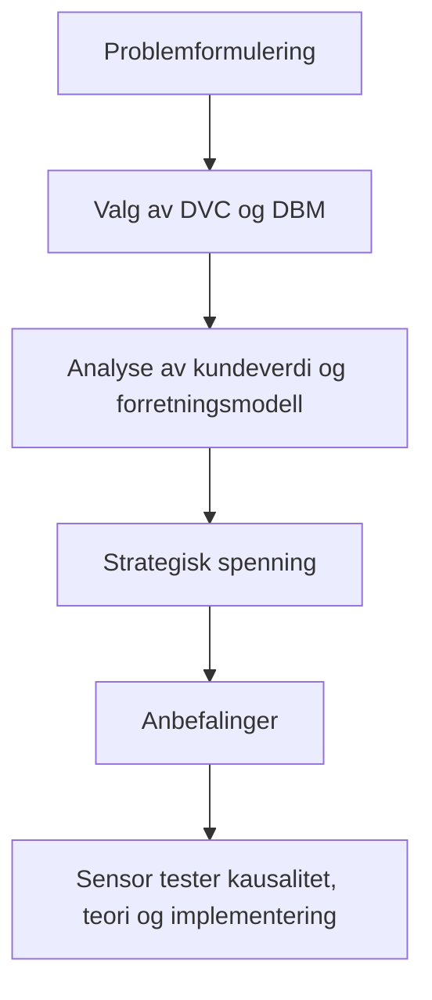

# Sensorvurdering av IT_strategi_eksamensprosjekt_Coop_case

## Sammendrag

- Den skriftlige oppgaven fremstår som en **god og tydelig avgrenset semesteroppgave** med ett overordnet argument: Coop App bør videreføres, men bare under strammere strategisk styring mot dokumentert butikkverdi. Oppgaven er særlig sterk når den kobler DVC og DBM til samme hovedspenning: forskjellen mellom digital aktivitet og faktisk value capture i butikk. fileciteturn0file0
- Rapporten viser **reell faglig forståelse** av de to valgte perspektivene og anvender dem meningsfullt på casen, men refleksjonsnivået er ikke høyt nok til toppkarakter. Flere steder blir analysen mer plausibel enn bevisført, særlig når anbefalingene skal operasjonaliseres. fileciteturn0file0turn0file7
- Den tydeligste styrken er **struktur, fokus og kildekritisk selvbevissthet**. Den tydeligste svakheten er at anbefalingene, særlig om kjedespesifikk diversifisering og styring av Lobyco, delvis går lenger enn kildene faktisk kan dokumentere. fileciteturn0file0
- Min foreløpige vurdering av **kun den skriftlige oppgaven** er **7**, med et troverdig spenn mot **10** dersom gruppen forsvarer kausalitet, alternative teorier og implementeringsmessige konsekvenser godt muntlig. fileciteturn0file0turn0file9
- Hvis jeg var eksaminator, ville jeg særlig presse på tre punkter: **er Coop App egentlig digital transformasjon eller bare IT-enabled forbedring**, **hvorfor omnichannel er riktig DBM-plassering fremfor en mer hybrid lesning**, og **hvordan KPI-hierarki og Lobyco-styring faktisk skulle implementeres gitt teknologisk gjeld og økonomisk press**. fileciteturn0file0turn0file1turn0file8

## Vurderingsgrunnlag

Denne vurderingen tar utgangspunkt i selve rapporten, fagets overordnede læringsmål og de kursmessige føringene som fremgår av oppsummerings- og eksamensmaterialet. Faget vektlegger at studentene skal kunne redegjøre for grunnleggende IT-strategiske modeller og begreper, beskrive relevante IT-strategier, identifisere og reflektere over modeller for å analysere IT-utfordringer og muligheter, og anvende sentrale modeller meningsfullt på konkrete cases. Kursoppsummeringen fremhever også at gode eksamensbesvarelser må være kritiske til egen løsning, tydelige om value propositions, se dynamiske effekter, og vise hva teoriene kan og ikke kan. fileciteturn0file7

Rapporten oppfyller på formalia-nivå de grunnleggende rammene godt: den har tydelig forside, eksplisitt problemfokus, egen kildekritikk, en sammenhengende analyse, tre anbefalinger og en konklusjon, og den oppgir omfang på 4 738 ord og 15 normalsider. I tillegg er bruk av generativ AI opplyst eksplisitt i innledningen, noe som er et pluss for transparens. fileciteturn0file0

## Samlet vurdering og karakterforslag

Den foreløpige karakterindikasjonen for **den skriftlige oppgaven alene** er **7**. Begrunnelsen er at rapporten er klart over bestått nivå og mer enn bare “grei”: den har en tydelig analytisk kjerne, en synlig strategisk linje og en god kobling mellom case og de to valgte teoriene. Samtidig har den flere faglige svakheter som er for store til at jeg vil kalle dem “mindre”: evidensgrunnlaget er asymmetrisk, alternative pensumperspektiver brukes lite, og anbefalingene er sterkere normativt enn empirisk forankret. fileciteturn0file0turn0file7

Det som trekker mest opp, er særlig avsnittet om analytisk tilnærming på s. 3, hvor gruppen skriver at DVC og DBM “utfyller hverandre” ved å koble digital kundeverdi til strategisk og økonomisk verdi. Det er en god og moden avgrensning, fordi den faktisk setter opp hele resten av besvarelsen. Tilsvarende er “strategic stance”-delen på s. 9 vellykket, fordi den samler analysen i én styringsmessig spenning: rapporten hevder at Coop har “sterk digital rekkevidde, men ikke at denne rekkevidden faktisk omsettes til value capture”. Det er et klart overordnet argument, ikke bare en oppramsing av funn. fileciteturn0file0

Det som trekker mest ned, er at rapporten ikke fullt ut viser hva teoriene **ikke** kan forklare, og at diskusjonen av alternativer blir for begrenset. Oppgaven sier mye om hvorfor KPI-hierarki, modulær kjedetilpasning og Coop-først-styring av Lobyco er fornuftige valg, men mindre om hvorfor andre plausible valg ville vært svakere, eller hvilke implementeringskostnader og organisatoriske motreaksjoner som kan undergrave dem. Nettopp dette er noe kursmaterialet peker på som sentralt: strategi må også vurderes i lys av implementering, monitorering, tilpasning og dynamiske effekter. fileciteturn0file0turn0file1turn0file7

Hvis gruppen muntlig kan forsvare tre ting godt, kan helhetsinntrykket løftes betydelig: for det første hvorfor Coop App bør forstås som en omnichannel-kapabilitet snarere enn et bredere økosystemspill; for det andre hvorfor anbefaling 2 ikke er et hopp fra “relevance” til “modulær differensiering”; og for det tredje hvordan KPI-hierarkiet faktisk kan måles under teknologisk gjeld og økonomisk press. Hvis de ikke kan det, vil karakteren tvert imot bli presset ned mot et tryggere 4/7-grensesnitt i en streng muntlig situasjon. fileciteturn0file0turn0file1turn0file5

## Læringsmål og dokumentasjon

| Læringsmål | Evidens i rapporten | Vurdering | Hva forsvaret bør dekke |
|---|---|---|---|
| Redegjøre for grunnleggende IT-strategiske modeller og begreper | DVC og DBM introduseres ryddig på s. 3, og sentrale begreper som experiences, relationships, evolution, relevance, value creation og value capture forklares eksplisitt. fileciteturn0file0 | **Sterk** | Kunne forklare modellene uten manus, avgrense dem riktig og vise hvorfor akkurat disse to ble valgt fremfor andre kursmodeller. |
| Beskrive og forklare relevante IT-strategier i organisatorisk kontekst | Oppgaven plasserer Coop som omnichannel-aktør på s. 7–9 og knytter appen til butikk-først-logikk, Lobyco-styring og KPI-hierarki. fileciteturn0file0turn0file2 | **Tilstrekkelig** | Vise at “omnichannel” ikke bare er etikettbruk, men faktisk en strategi med organisatoriske konsekvenser for governance, investering og kundeløfte. |
| Identifisere og reflektere over modeller for å analysere IT-utfordringer og muligheter | På s. 9 sammenfatter rapporten hovedspenningen som gapet mellom digital rekkevidde og value capture, og på s. 2–3 er kildeusikkerhet eksplisitt drøftet. fileciteturn0file0 | **Tilstrekkelig** | Vise mer eksplisitt hva DVC og DBM ikke fanger, og hvorfor for eksempel Wessel, Porter, økosystem- eller implementeringsperspektiver kunne endret analysen. |
| Anvende sentrale begreper og modeller meningsfullt på en case | Hele analysen på s. 3–12 er caseorientert og leder fram til tre konkrete anbefalinger. Særlig godt fungerer overgangen fra DVC/DBM til “strategic stance” på s. 9. fileciteturn0file0 | **Tilstrekkelig til sterk** | Kunne forsvare den kausale kjeden fra modell til anbefaling: hvorfor følger akkurat disse tre anbefalingene av analysen, og ikke andre? |

Oppgaven treffer læringsmål 1 best. Den viser at gruppen har forstått de valgte modellene og kan gjengi og bruke dem med rimelig sikkerhet. Det er ikke bare navnebruk; det er faktisk analytisk anvendelse, særlig i samspillet mellom DVCs kundeverdilogikk og DBMs skille mellom value creation og value capture. fileciteturn0file0turn0file7

Læringsmål 3 og 4 er der vurderingen stopper på 7-nivå snarere enn 10-nivå. Gruppen identifiserer relevante problemer, men reflekterer i mindre grad over teoriens blindsoner, og de viser for lite eksplisitt hvorfor nettopp disse anbefalingene er bedre enn realistiske alternativer. Kursmaterialet legger vekt på reflektert anvendelse og på å bygge bro mellom modeller; her er det bra, men ikke eksepsjonelt. fileciteturn0file7turn0file9

## Teoretisk og analytisk kvalitet

DVC er i hovedsak **korrekt forstått** og relativt godt anvendt. Gruppen bruker experiences, relationships, evolution, ytre lag og relevance på en måte som faktisk belyser appens kundeside. Særlig godt er poenget på s. 4 om at appens verdi ikke ligger i å være en selvstendig salgskanal, men i å styrke den fysiske butikkopplevelsen. Det er en presis tilpasning av DVC til Coop-casen. Også refleksjonen om at “situational experiences” kan undergrave hele kundereisen ved feil i Scan & Pay eller bonuslogikk, er analytisk relevant og ikke bare beskrivende. fileciteturn0file0

Det DVC-delen mangler, er en skarpere diskusjon av **grensegangen mellom kundeverdi og forretningsverdi**. Rapporten vet at dette skillet finnes, men i praksis glir den noen ganger over i en antakelse om at høy relevance og sterk relationship sannsynligvis er strategisk bra, selv om den samtidig sier at dette ikke er bevist. Den beste eksaminatorinnvendingen her vil være: Hvis relevans er høy, men økonomisk effekt ikke kan dokumenteres, hvordan vet dere at dere ikke bare beskriver en dyr serviceforbedring? Det ville styrket DVC-bruken om gruppen tydeligere hadde sagt hva modellen **ikke** kan avgjøre alene. fileciteturn0file0

DBM er også i hovedsak **korrekt forstått**, og plasseringen av Coop som primært omnichannel er plausibel. Oppgaven får godt fram at appen fungerer som “et digitalt bindeledd” som støtter fysisk butikkhandel, og den ser riktig at Lobyco introduserer en potensiell modular-producer-logikk som må styres. Det er et sterkt grep at DBM ikke bare brukes til klassifisering, men til å identifisere en governance-spenning. fileciteturn0file0turn0file2

Svakheten i DBM-analysen er at plasseringen blir litt for glatt. Rapporten skriver tydelig at Coop “agerer fortsatt som omnichannel-aktør” etter at coop.dk er stengt, men drøfter i mindre grad om retail media, leverandørrettede kampanjer og Lobycos eksterne virksomhet drar konsernet i en mer hybrid retning. Her kunne økosystem- og plattformperspektiver fra pensum styrket analysen betydelig, fordi de ville gitt et rikere språk for leverandørinteraksjoner, datadrevne matchingmekanismer og governance. Kursets økosystemdel understreker nettopp at plattformer skaper verdi ved å muliggjøre interaksjoner mellom eksterne produsenter og konsumenter, og at nettverkseffekter kan endre strategisk logikk. fileciteturn0file0turn0file5

De mest relevante alternative teoriene fra pensum som kunne løftet oppgaven, er tre. **Wessel et al.** ville gitt en skarp drøfting av om Coop faktisk er i digital transformasjon, eller om appen først og fremst “supports and reinforces an existing value proposition and identity”. **Implementeringsperspektivet** ville styrket realismen i anbefalingene, særlig rundt måling, tilpasning og historisk teknisk gjeld. **Disrupsjon/digital innovasjon** ville gitt gruppen et språk for å avvise en overdrevet forestilling om appen som “transformativ”; mest sannsynlig er dette en sustaining eller IT-enabled kapabilitet, ikke en disruptiv ny forretningsmodell. fileciteturn0file1turn0file6turn0file8

En eksaminator vil derfor trolig stille spørsmål som: *Hvorfor er Coop App ikke først og fremst et eksempel på IT-enabled organisational transformation?*, *Hvorfor er Lobyco ikke et plattform-/økosystemcase?*, og *Hvis appen er strategisk viktig, hvorfor er bevisførslen for margin- og trafikkeffekt så svak?* Det er nettopp i svarene på disse spørsmålene at 10-nivået må demonstreres muntlig. fileciteturn0file0turn0file5turn0file8

## Anbefalingene som sensortest

Anbefaling 1 om KPI-hierarki er den **klart sterkeste**. Den følger direkte av rapportens eget hovedproblem, nemlig at Coop har digital aktivitet uten dokumentert butikkøkonomisk effekt. Når gruppen skriver at Coop bør slutte å “måle appen strategiske verdi gjennom digitale aktivitetsmål alene”, er det en presis konsekvens av både DVCs skille mellom outputs og dypere verdi og DBMs fokus på value capture. Dette er en anbefaling som både er logisk, teoretisk forankret og strategisk relevant for toppledelsen. fileciteturn0file0

Det en eksaminator vil angripe her, er **operasjonaliseringen**. Rapporten sier lite om hvordan man faktisk skal attribuere effekter til appen i et miljø med mange samtidige drivere: pris, lokasjon, kampanjer, sortiment, vær, konkurrenttiltak og butikkledelse. Den sier også lite om hvilke dataintegrasjoner som kreves, og i hvilken grad teknologisk gjeld gjør dette dyrt eller tregt. Gode forsvarssvar må derfor handle om målelogikk, kontrollgrupper, før/etter-design, segmentering og hvorfor “perfekt kausalitet” ikke er et realistisk krav i praksis. fileciteturn0file0turn0file1

Anbefaling 2 om kjedespesifikk diversifisering i en felles plattform er **god, men mer sårbar**. Den bygger på et reelt poeng i analysen: relevance er ikke lik for 365discount, Kvickly, SuperBrugsen og Brugsen. Når rapporten skriver at “én felles applogikk kan derfor bli begrensende”, har den et saklig poeng. Problemet er at steget fra denne observasjonen til en konkret modulær plattformstrategi er større enn rapporten helt innrømmer. Den empiriske støtten hviler her dels på kommersielle utenlandseksempler, dels på en plausibel, men ikke fullt dokumentert antakelse om at mer differensiering vil gi bedre verdi enn en sterk felles løsning. fileciteturn0file0

Her vil jeg som sensor spesielt spørre: *Hvor går grensen mellom relevant differensiering og kostnadsdrivende kompleksitet?* og *Hvorfor er ikke personalisering innen én felles logikk nok?* Rapporten er inne på kostnadsrisikoen, men den kunne vært langt mer presis om governance, innholdsproduksjon, driftsmodell og prioriteringsmekanismer. Anbefalingen er dermed strategisk interessant, men ikke fullt ut bevist. fileciteturn0file0

Anbefaling 3 om Lobyco og retail media som Coop-først-kapabilitet er analytisk sett **interessant og delvis sterk**, fordi den springer ut av rapportens beste DBM-poeng: spenningen mellom Coop som omnichannel-aktør og Lobyco som mulig modular producer. Det er klokt å gjøre dette til et governance-spørsmål, ikke bare et vekstspørsmål. Det er også godt sett at retail media kan undergrave kundetillit dersom leverandørlogikken blir for dominerende. fileciteturn0file0

Svakheten er igjen praktisk presisjon. Forslaget om at “en fast andel av Lobyco kun arbeider med å støtte Coop” er intuitivt, men fortsatt grovt. Hvor stor andel? Etter hvilke kriterier? Hva er gevinsten av intern prioritet sammenlignet med muligheten for ekstern læring og skalafordeler? Og hva gjør man hvis ekstern Lobyco-vekst faktisk forbedrer Coops egen kapabilitet? Her må gruppen muntlig kunne diskutere styringsmodeller, insentiver, mandat, porteføljestyring og hvorfor “Coop-først” ikke automatisk betyr “Coop-only”. fileciteturn0file0

## Kildegrunnlag, formalia og originalitet

Kildekritikken er over gjennomsnittet god for nivået. Allerede på s. 2–3 gjør gruppen det helt eksplisitt at Lobyco, Playable og Shortcut er virksomhetsnære kilder med markedsføringsmotiv, at de fremhever positive effekter, og at de ikke alene kan brukes som bevis for strategisk eller økonomisk verdiskaping. Den formuleringen er viktig, fordi den viser at gruppen ser problemet med asymmetrisk kildekvalitet og ikke prøver å skjule det. fileciteturn0file0

Samtidig løser ikke rapporten dette problemet fullt ut; den **håndterer det redelig, men kan ikke oppheve det**. Når anbefalingene senere delvis støttes på tall om høyere handlefrekvens, basket size og profit growth fra kommersielle casekilder, blir argumentasjonen fortsatt svakere enn den ser ut til på overflaten. Gruppen sier riktig at årsakssammenheng ikke kan fastslås, men flere av de normative anbefalingene hviler likevel på at disse sammenhengene trolig eksisterer. Det er akseptabelt på dette nivået, men det er også akkurat her en sensor vil presse dem hardest. fileciteturn0file0

Metakommunikasjon om begrensninger er et klart pluss. Konklusjonen på s. 13 er ryddig når den sier at vurderingen er gjort på offentlig tilgjengelig materiale, og at en mer presis konklusjon vil kreve interne data om butikkbesøk, basket size og marginutvikling. Det styrker rapportens troverdighet betydelig. Kursets eksamensforberedelse fremhever nettopp at man må være kritisk mot egen besvarelse og være tydelig om hva modeller kan og ikke kan. På dette punktet følger gruppen kursånden godt. fileciteturn0file0turn0file7

Formelt er rapporten lesbar, godt strukturert og enkel å følge. Referanselisten er til stede, og AI-bruk er opplyst eksplisitt. Det finnes likevel flere små språklige og terminologiske svakheter: norsk/dansk/engelsk blandes en del, enkelte formuleringer er unøyaktige eller klønete, og noen fagord glir mellom beskrivelse og analyse. Dette er ikke karakterdefinerende alene, men det er nok til at teksten ikke fremstår helt “ferdigpolert” på 10/12-nivå. fileciteturn0file0

Når det gjelder originalitet og plagiat, ser jeg **ingen tydelige røde flagg i selve teksten**. Rapporten oppgir AI-bruk transparent, bruker egne mellomresonnementer og markerer direkte sitater tydelig. Det kan likevel ikke trekkes noen endelig konklusjon om originalitet uten institusjonell likhetskontroll. Det mest kritiske jeg ville sagt som sensor, er derfor ikke “mistanke om plagiat”, men at enkelte deler ligger tett på casekildenes språk og logikk, særlig der markedsføringskilder omskrives strategisk. fileciteturn0file0

## Sannsynlige spørsmål fra øvrig pensum

| Tema | Hvorfor dette temaet er sannsynlig | Konkrete spørsmål | Hva et godt svar bør inneholde |
|---|---|---|---|
| Digital transformasjon vs. IT-enabled transformation | Rapporten beskriver appen som strategisk viktig, men casen ser også ut til å støtte eksisterende butikkidentitet mer enn å redefinere den. fileciteturn0file0turn0file8 | *Er Coop App et eksempel på digital transformasjon eller IT-enabled organisational transformation?* | Et godt svar må bruke Wessel presist: hvis teknologien hovedsakelig støtter eksisterende “bricks-and-mortar”-verditilbud, er det nærmere IT-enabled enn full DT. |
| Disrupsjon og digital innovasjon | Rapporten snakker om videre digital utvikling, men ikke eksplisitt om innovasjonstype eller disruptivitet. fileciteturn0file0turn0file6 | *Er Coop App sustaining, digital innovasjon eller disruptiv innovasjon?* | Et godt svar bør avvise ukritisk “disruption”-språk og forklare hvorfor appen sannsynligvis er en datadrevet, kundevendt, men i hovedsak sustaining kapabilitet. |
| Digitale økosystemer og plattformlogikk | Lobyco og retail media åpner for leverandørinteraksjoner, kundedata og mulig plattformstyring. fileciteturn0file0turn0file5 | *Kan Lobyco utvikles til en økosystem-hub, og hvilke nettverkseffekter ville i så fall være relevante?* | Et godt svar bør skille mellom intern kapabilitet, modulær produsent og faktisk plattform som kobler eksterne produsenter og konsumenter under governance-regler. |
| Implementering, monitorering og teknologisk gjeld | Rapportens anbefalinger krever styring, måling og endringskapasitet, og pensum vektlegger implementering og tilpasning. fileciteturn0file0turn0file1 | *Hvordan ville dere implementert KPI-hierarkiet gitt Coops historiske teknologiske gjeld?* | Et godt svar bør inneholde prioritering, sekvensering, målekapabilitet, feedback-løkker og realistiske kompromisser mellom kontroll og innovasjon. |
| Porter, posisjonering og forretningsmodell | Rapporten bruker DBM godt, men sier mindre om klassisk strategisk posisjonering og aktivitetssystemer. fileciteturn0file0turn0file2turn0file3 | *Hvor passer DVC og DBM inn i en mer klassisk strategiforståelse à la Porter?* | Et godt svar må vise at forretningsmodellen ikke er strategi i seg selv, men grunnlag for strategisk posisjon, trade-offs og ulike aktivitetssystemer. |

De ti vanskeligste spørsmålene jeg ville stilt, i fallende rekkefølge, er disse:

| Spørsmål | Hva det egentlig tester | Hva et 12-svar ville vist, mot et 7-svar |
|---|---|---|
| Hvorfor følger KPI-hierarki nødvendigvis av DVC og DBM? | Kausal kobling mellom teori og anbefaling | 12-svar viser eksplisitt hvordan outputs, relevance og value capture krever et trinnvis måleregime; 7-svar sier bare at “man må jo måle bedre”. |
| Hvorfor er Coop fortsatt omnichannel etter stengingen av coop.dk? | Presisjon i DBM-bruk | 12-svar forklarer at digitalt-fysisk kundebindeledd kan være omnichannel uten full e-handel; 7-svar gjentar bare at appen støtter butikk. |
| Hvorfor er ikke anbefaling 2 bare dyr kompleksitet? | Strategisk realisme | 12-svar skiller mellom personalisering, segmentering og modulær differensiering og drøfter governance; 7-svar sier at “kundene er ulike”. |
| Er Coop App digital transformasjon eller IT-enabled forbedring? | Bredere pensumforankring | 12-svar bruker Wessel begrepsskarp; 7-svar svarer intuitivt uten definisjoner. |
| Hvis Lobyco skaper ekstern verdi, hvorfor skal Coop begrense det? | Governance og trade-offs | 12-svar drøfter intern prioritet mot ekstern læring og skalafordeler; 7-svar sier bare “butikkene kommer først”. |
| Hvordan ville dere dokumentert at appen faktisk øker margin, ikke bare aktivitet? | Evidensforståelse og metodebevissthet | 12-svar foreslår måledesign, eksperimenter eller quasi-eksperimenter; 7-svar peker bare på flere KPI-er. |
| Hvorfor bruker dere ikke Wessel, Porter eller økosystemteori i analysen? | Refleksjon over teoriutvalg | 12-svar kan begrunne fravalg og si hva som tapes; 7-svar sier at to teorier var nok. |
| Er retail media et kundeproblem eller et styringsproblem? | Analytisk presisjon | 12-svar viser at det er begge deler, og forklarer koblingen mellom governance og relevance; 7-svar velger én side uten nyanser. |
| Hva er det sterkeste argumentet mot deres egen anbefaling? | Kritisk selvrefleksjon | 12-svar identifiserer svakeste premiss og hvordan det kan håndteres; 7-svar forsvarer bare anbefalingen. |
| Hvis dere hadde fått interne Coop-data i morgen, hva ville dere testet først? | Strategisk prioritering | 12-svar prioriterer få, beslutningskritiske hypoteser; 7-svar ramser bare opp “alt man kunne målt”. |

## Valg av innledning og endelig konklusjon

De sterkeste temaene for en innledning på 4–5 minutter er etter min vurdering **to muligheter**. Den første er *“Fra digital rekkevidde til value capture”*. Det er det reneste uttrykket for oppgavens hovedargument, og det lar gruppen presentere både DVC, DBM og KPI-anbefalingen i én sammenhengende fortelling. Den andre er *“Den strategiske spenningen mellom Coop som omnichannel-aktør og Lobyco som modular producer”*. Den er sterk fordi den er mer krevende, mer særpreget og gir rom for både teori og ledelsesimplikasjoner. Begge disse valgene lar gruppen styre samtalen inn mot sine beste analytiske grep. fileciteturn0file0

Et tredje brukbart tema er *“Hvorfor relevans ikke er nok”*. Det er pedagogisk godt fordi det tar utgangspunkt i DVC og leder fram til rapportens hovedproblem: høy kundeverdi er ikke det samme som dokumentert butikkøkonomisk verdi. Dette temaet vil fungere særlig godt dersom gruppen vil fremstå refleksiv og ikke bare anbefalingsdrevet. fileciteturn0file0

Det jeg ville frarådet, er en innledning som bare går gjennom **de tre anbefalingene én for én** uten først å etablere én overordnet analytisk spenning. Det blir fort refererende og gjør gruppen sårbar for spørsmål om hvorfor anbefalingene henger sammen. Jeg ville også frarådet å bruke **“Coop App skaper mye kundeverdi”** som hovedtema, fordi akkurat det er det letteste for sensor å undergrave med spørsmålet: *ja, men hvor er value capture?* Da mister gruppen initiativet tidlig. fileciteturn0file0

Min endelige, foreløpige sensorkonklusjon er derfor denne: Dette er en **god, gjennomtenkt og relativt moden semesteroppgave** som har valgt en fornuftig avgrensning, brukt to relevante teorier konsistent og landet i tre anbefalinger som i hovedsak er strategisk fornuftige. Den når likevel ikke helt opp til 10 på skrift alene, fordi refleksjonen over teoriens blindsoner, implementeringsrealismen og styrken i bevisførselen ikke er solid nok. Som skriftlig produkt står den sterkest på problemforståelse og struktur, svakest på dokumentasjon av kausal økonomisk effekt og på forsvar av de mest ambisiøse anbefalingene. Foreløpig karakterforslag: **7**. fileciteturn0file0turn0file7turn0file9